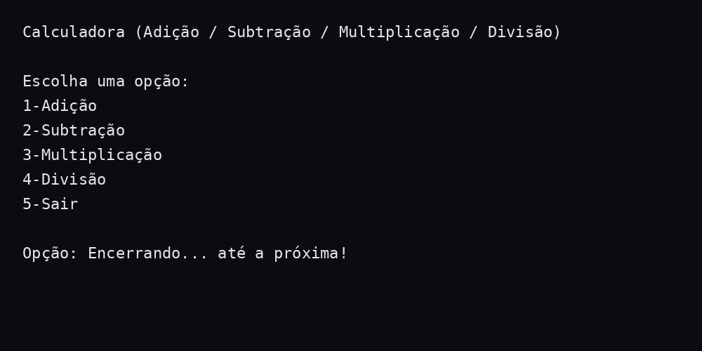
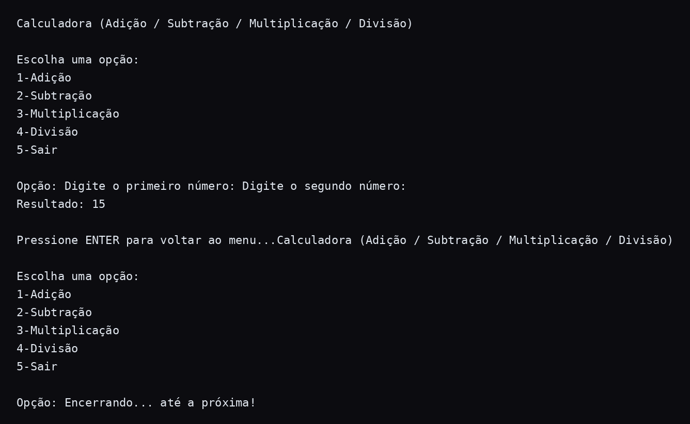
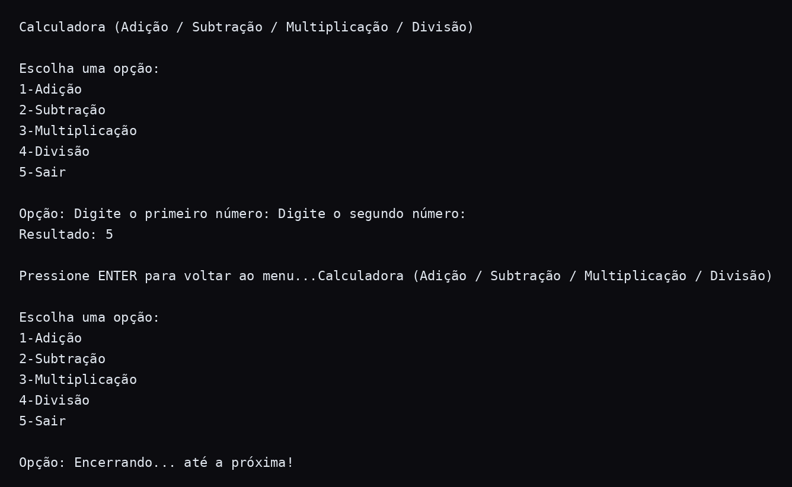
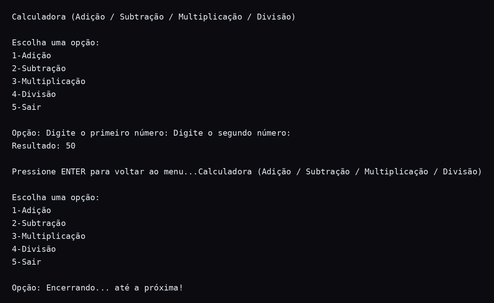
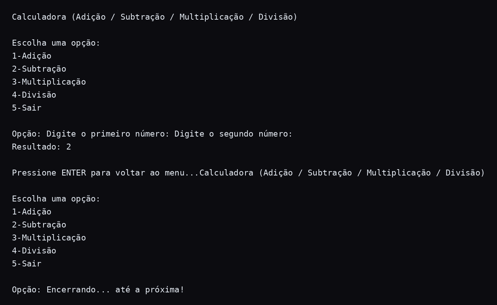

# Checkpoint 1 — Calculadora em Console C#

Aplicação de console em C# para realizar as operações básicas:
- Adição
- Subtração
- Multiplicação
- Divisão (com tratamento de divisão por zero)

## Integrantes

- Bruno

## Requisitos atendidos

- [x] Exibe o título: **"Calculadora (Adição / Subtração / Multiplicação / Divisão)"**
- [x] Exibe menu com opções de 1 a 5
- [x] Solicita dois números para as operações
- [x] Calcula e exibe o resultado
- [x] Mantém execução em loop até escolher **5-Sair**
- [x] Trata erro de divisão por zero
- [x] Trata entrada inválida de opção e números

## Como executar

### Pré-requisitos
- .NET SDK 8.0+

### Rodando o projeto
```bash
cd fiap-checkpoint1-calculadora
~/.dotnet/dotnet run
```

## Evidências (prints)

> Substitua os placeholders abaixo pelos screenshots finais da execução.
>
> Para gerar execuções-base automaticamente (em texto) e facilitar os prints:
>
> ```bash
> ./scripts/run-evidence.sh
> ```
>
> Os logs ficam em `docs/evidence/*.txt`.

### 1) Tela com menu carregado


### 2) Evidência de teste — Adição


### 3) Evidência de teste — Subtração


### 4) Evidência de teste — Multiplicação


### 5) Evidência de teste — Divisão


## Exemplo de uso

```text
Calculadora (Adição / Subtração / Multiplicação / Divisão)

Escolha uma opção:
1-Adição
2-Subtração
3-Multiplicação
4-Divisão
5-Sair
```
